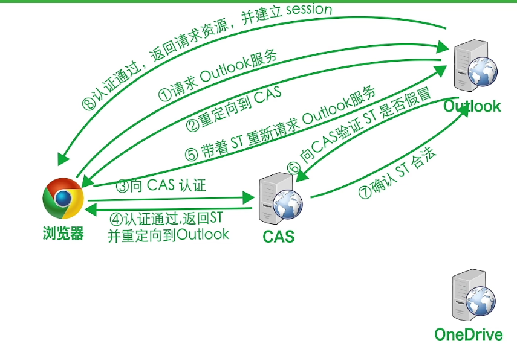
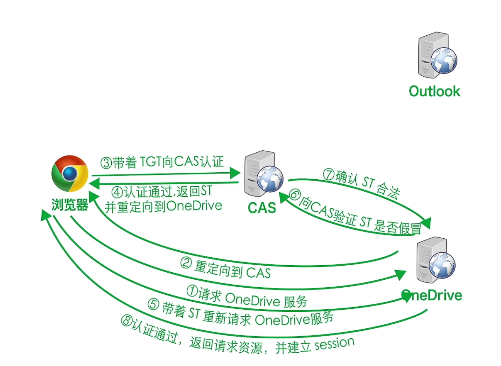

# 单点登录系统的设计与实现

[单点登录（SSO）介绍](https://developer.aliyun.com/article/636281#:~:text=本文介绍了单点登录（SSO）的概念、背景和技术实现，包括同域和不同域的单点登录方案。文章还提供了CAS流程和Spring-Session的相关链接，适合想了解单点登录的开发者阅读。)

## 一、实验目的

1. 本次实验的目的是掌握Java企业级应用开发工具的使用方法；掌握Web编程技术，掌握Servlet，JSP，Filter，Listener等Web设计元素的使用；掌握Tomcat服务器的使用。

2. 设计开发完成一个基于Web的单点登录系统。熟练掌握单点登录系统的工作原理。能够规范的表述所设计的系统。

3. **不使用SpringBoot**。抄袭计0分。

## 二、实验项目内容

设计开发完成“单点登录系统”软件。要求如下：

1、实现2个简单的、需要用户登录才能使用的应用系统，这2个应用系统称为web1和web2；登录进去后，在主页面显示该系统已经登录的所有用户的信息和登录时间。并提供两个系统相互跳转的链接。一个应用系统可以登录多个用户。

2、设计实现一个单点登录系统ssoserver；提供登录页面等功能。（√）登录后，在主页面显示已经登录的所有用户的信息和登录时间。（√）并提供跳转到web1和web2的链接，能够直接登录到web1或者web2（√）。

3、未登录状态下访问系统web1或者系统web2，跳转到单点登录系统ssoserver进行登录验证，登录成功后，跳转到web1或者Web2；（√）

4、应用系统web1、web2和ssoserver提供登出注销功能。登出任何一个系统后，再次访问任何一个系统都需要重新登录。登出注销后，跳转到一个页面，显示登出注销成功等信息。(√)

5、应用系统具备账号注册、登录、登出、禁用，查看登录历史记录等管理功能。可以实现自定义功能。注意操作使用的方便性，注意设计思想的表达，注意优化代码结构，优化类的职责分工。代码有注释。

## 三、实验过程或算法

### [CAS（Central Authentication Service）]([CAS单点登录(一)——初识SSO-CSDN博客](https://blog.csdn.net/Anumbrella/article/details/80821486))

CAS是中央认证服务，每个单点登录的架构都需要实现一个CAS。

[GitHub](https://github.com/apereo/cas)

#### 一些概念

* 服务标识：每个系统或应用都会从CAS获得一个唯一标识
* TGT（Ticket Granting Ticket）：是在成功通过CAS认证后通过cookie的形式发放给客户端的，我们可以把它比作游乐园的通票，有了它就可以畅玩游乐园中的所有项目。

* ST（Service Ticket）：这好比是某个具体游玩项目的门票，需要通过通票TGT来领取这个

#### 具体流程

CAS官网上的标准流程，具体流程如下：

1. 用户访问app系统，app系统是需要登录的，但用户现在没有登录。
2. 跳转到(重定向到)CAS server，即SSO登录系统, SSO系统也没有登录，弹出用户登录页。
3. 用户填写用户名、密码，SSO系统进行认证后，将登录状态写入SSO的session，浏览器（Browser）中写入SSO域下的Cookie。
4. SSO系统登录完成后会生成一个ST（Service Ticket），然后跳转到app系统，同时将ST作为参数传递给app系统。
5. app系统拿到ST后，从后台向SSO发送请求，验证ST是否有效。
6. 验证通过后，app系统将登录状态写入session并设置app域下的Cookie。

至此，跨域单点登录就完成了。以后我们再访问app系统时，app就是登录的。接下来，我们再看看访问app2系统时的流程。

1. 用户访问app2系统，app2系统没有登录，跳转到SSO。
2. 由于SSO已经登录了，不需要重新登录认证。
3. SSO生成ST，浏览器跳转到app2系统，并将ST作为参数传递给app2。
4. app2拿到ST，后台访问SSO，验证ST是否有效。
5. 验证成功后，app2将登录状态写入session，并在app2域下写入Cookie。

这样，app2系统不需要走登录流程，就已经是登录了。SSO，app和app2在不同的域，它们之间的session不共享也是没问题的。

